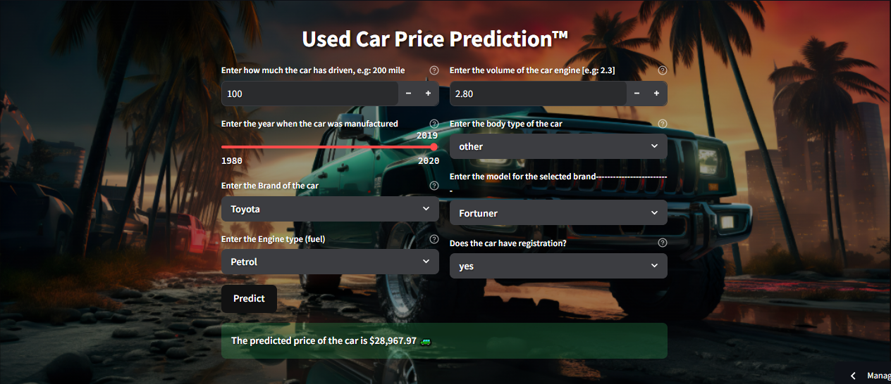

<h1 align="center"> Used Car Price Prediction Dashboard</h1>

  

A modern Machine Learning application that predicts the resale price of a used car based on its specifications. Built using a **Random Forest Regression model** and deployed with an interactive **Streamlit dashboard**.

## 📈 Project Overview

This project aims to estimate the selling price of a used car based on various features such as:
- Mileage
- Engine Volume
- Brand and model
- Fuel type
- Purchased Year

The Random Forest model provides highly accurate predictions after extensive data preprocessing, exploratory data analysis (EDA), and model evaluation.

## 🛠️ Workflow

### 1. Data Cleaning and Preprocessing
- Removed irrelevant columns and handled missing values
- Converted categorical data (brand, model, fuel type) into numerical representations
- Standardized mileage and engine size into clean, usable numerical values

### 2. Exploratory Data Analysis (EDA)
- Analyzed price distributions across different brands
- Visualized the impact of:
  - Fuel type  on resale value
  - Car age on depreciation
  - Mileage influence on pricing trends

### 3. Model Building
- Trained a Linear Regression model as baseline
- Implemented Random Forest Regressor which outperformed other models
- Selected Random Forest as final model based on superior accuracy

### 4. Dashboard Development
Built a fully interactive dashboard using Streamlit with:
- Dynamic input fields (mileage, engine volume, brand, etc.)
- Real-time price prediction
- Clean, modern UI with custom styling

## 📊 Key Features
- Real-time price estimation
- Support for 50+ car brands
- Mileage and age-based depreciation
- Clean, user-friendly interface

## 🛠️ Tech Stack

### Core Technologies
| Category        | Technologies                          |
|-----------------|--------------------------------------|
| Programming     | Python 3.9+                          |
| Data Processing | Pandas, NumPy                        |
| Visualization   | Matplotlib, Seaborn                  |
| Machine Learning| Scikit-learn                         |
| Deployment      | Streamlit                            |

### Machine Learning
- Random Forest Regressor (n_estimators=200)
- GridSearchCV for hyperparameter tuning
- OneHotEncoder for categorical features
- StandardScaler for numerical features
  
## 🤝 Let's Connect!

If you like this project or have any feedback, feel free to connect with me!

